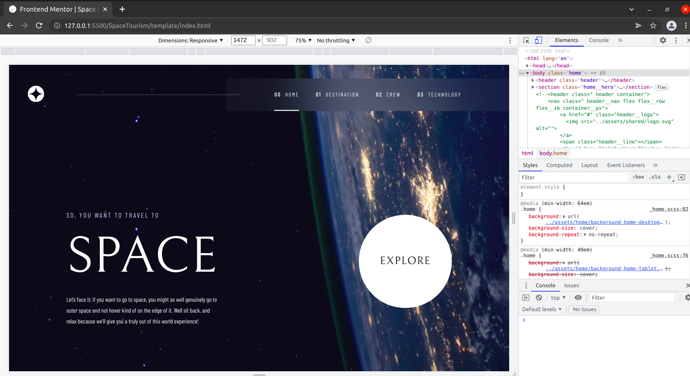
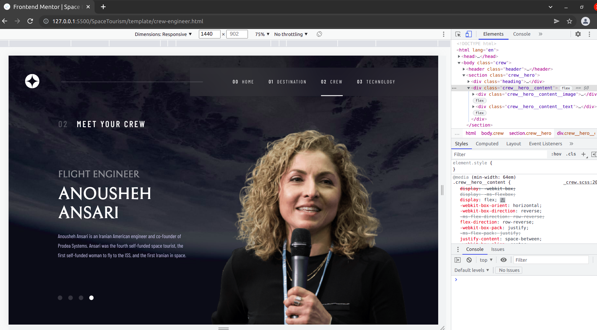
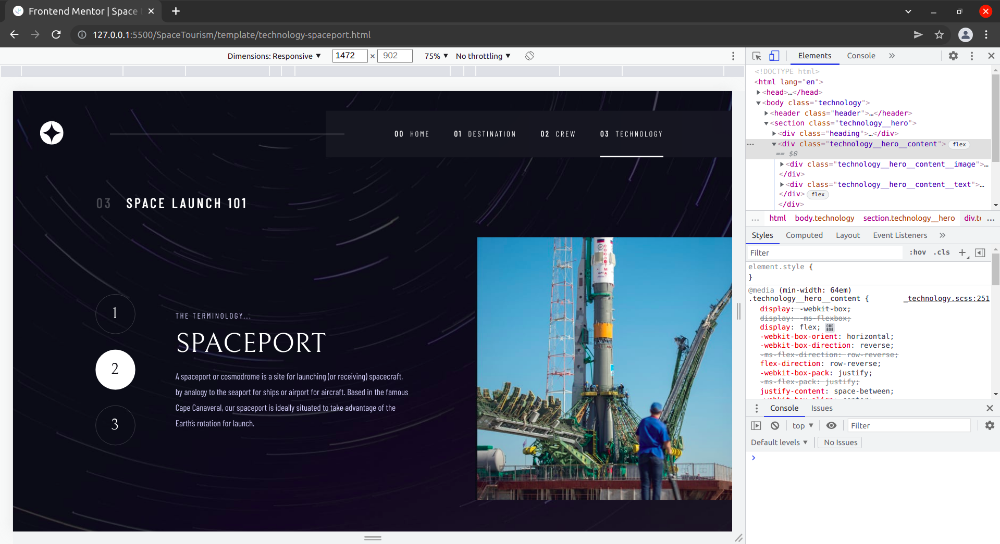
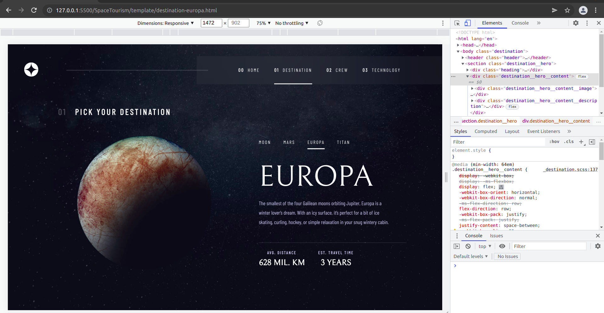
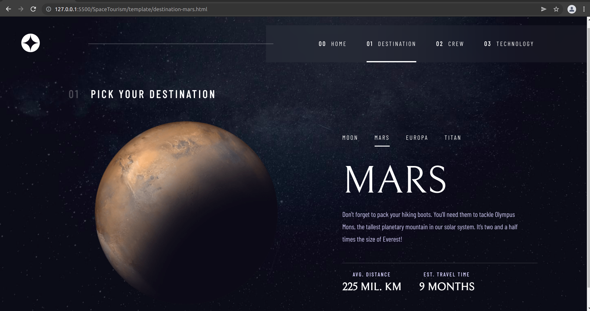
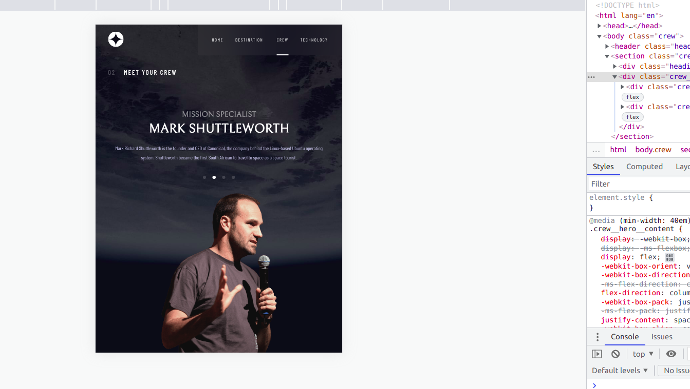
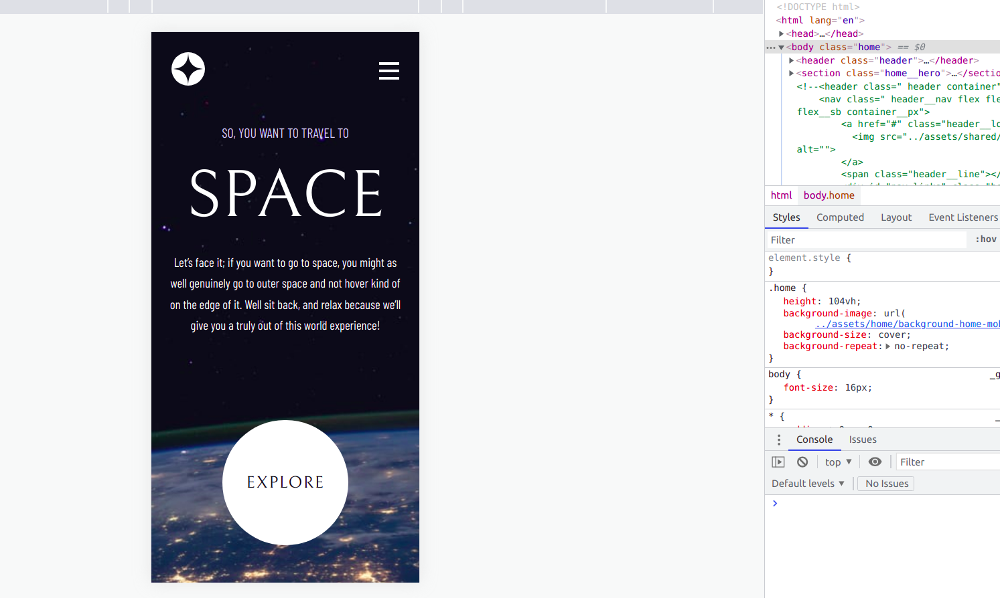
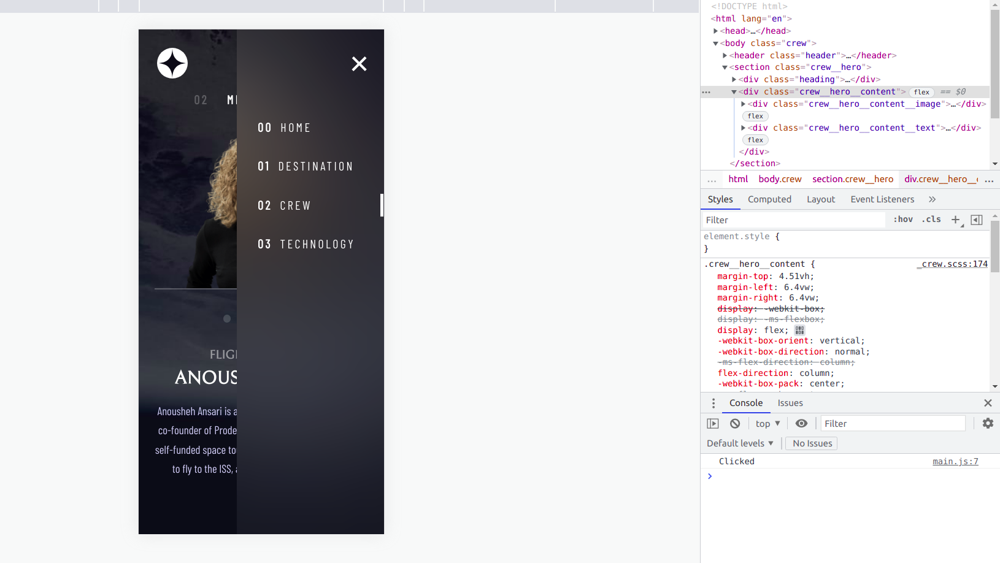

# Frontend Mentor - Space tourism website solution

This is a solution to the [Space tourism website challenge on Frontend Mentor](https://www.frontendmentor.io/challenges/space-tourism-multipage-website-gRWj1URZ3). Frontend Mentor challenges help you improve your coding skills by building realistic projects. 

## Table of contents

- [Overview](#overview)
  - [The challenge](#the-challenge)
  - [Screenshot](#screenshot)
  - [Links](#links)
- [My process](#my-process)
  - [Built with](#built-with)
  - [What I learned](#what-i-learned)
  - [Continued development](#continued-development)
  - [Useful resources](#useful-resources)
- [Author](#author)
- [Acknowledgments](#acknowledgments)


## Overview

### The challenge

Users should be able to:

- View the optimal layout for each of the website's pages depending on their device's screen size
- See hover states for all interactive elements on the page
- View each page and be able to toggle between the tabs to see new information

### Screenshot












### Links

- Solution URL: [GitHub](https://github.com/mauryahdx/SpaceTourism)


## My process

### Built with

- Semantic HTML5 markup
- CSS custom properties
- Flexbox
- Some Javascript
- Mobile-first workflow
- [Sass](https://sass-lang.com/) - For styles


### What I learned

With this project I have learnt a lot about Sass mixins, variables, breakpoints to make it responsive, classes and project structuring. Some of the useful mixins I would like to mention are :-


```scss
@mixin circle(){
    border-radius: 100%;
}
```
```scss
@mixin flex($flex-direction,$justify-content,$align-item){
    display: flex;
    flex-direction: $flex-direction;

    @if $justify-content{
        justify-content: $justify-content;
    }

    @if $align-item{
        align-items: $align-item;
    }

}
```

```scss
@mixin vertical-align() {
   // position: absolute;
    top: 50%;
    transform: translateY(-50%);    
}
```


### Continued development

In future I will update this project by making it a single page app using ReactJS. And I will also use some animations to enhance the UX


### Useful resources

- [Sass Css with Superpowers](https://sass-lang.com/documentation) - This helped me a lot in writing styles for the projects. It makes life a lot easier while writing CSS selectors and structuring the project
- [Codepen](https://codepen.io/) - whenever i got stuck at something tricky than this website rescued me without a fuss.


## Author

- Website - [Surya Prakash Mourya](https://github.com/mauryahdx/)
- Frontend Mentor - [@mauryahdx](https://www.frontendmentor.io/profile/mauryahdx)
- Twitter - [@mauryahdx](https://www.twitter.com/mauryahdx)


## Acknowledgments

I would like to thank the whole  YouTube Coding Community for putting out the free quality content that helped me 
a lot in making this project from scratch.

## How to run Project
Install Live Server Extension on VSCode and go to directory "/SpaceTourism/template/index.html" and run the live server by clicking on its icon